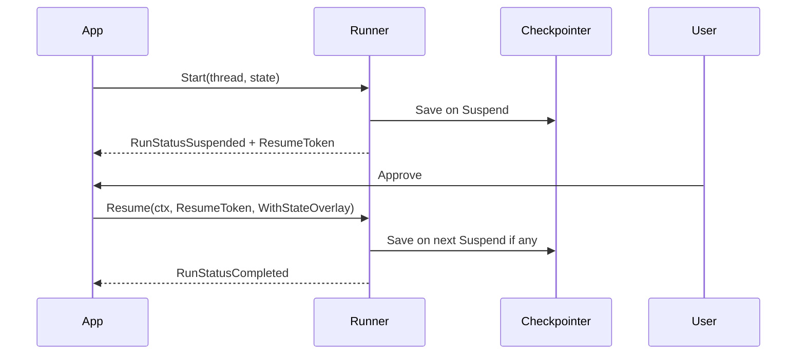

# Human-in-the-Loop (HITL)

Демонстрирует паузу графа до действия человека и продолжение через `Resume`.

## Было

- Узел возвращал `(state, flowy.ErrSuspend)`.
- Клиент вручную разбирал checkpoint и вызывал старый `Stream` с `NextNode`.

## Стало

1. Узел `payment` возвращает `flowy.Suspend("waiting_for_user_approval")`.
2. Runtime автоматически вызывает `Checkpointer.Save`.
3. HTTP/UI слой вызывает `Runner.Resume(ctx, result.ResumeToken, flowy.WithStateOverlay(approve))`.
4. По умолчанию граф продолжает с `ExecutionPointer` из snapshot (`payment`) с обновлённым state. Если overlay делает wait-узел stale (например, пришёл новый маршрут вместо ожидания ответа), передайте `WithResumeTargetPolicy` — см. `examples/conditional_routing` и `runner_resume_overlay_test.go`.

## Запуск

```bash
cd examples/hitl_agent
go run main.go
```

Handoff в stream-режиме (`Stream` + `RequestLocalHandoff`) и семантика terminal events — см. `runner_lifecycle_test.go` и `stream_test.go` (`EventHandoff`, `ErrHandoffEnqueueFailed`).

## Lifecycle


