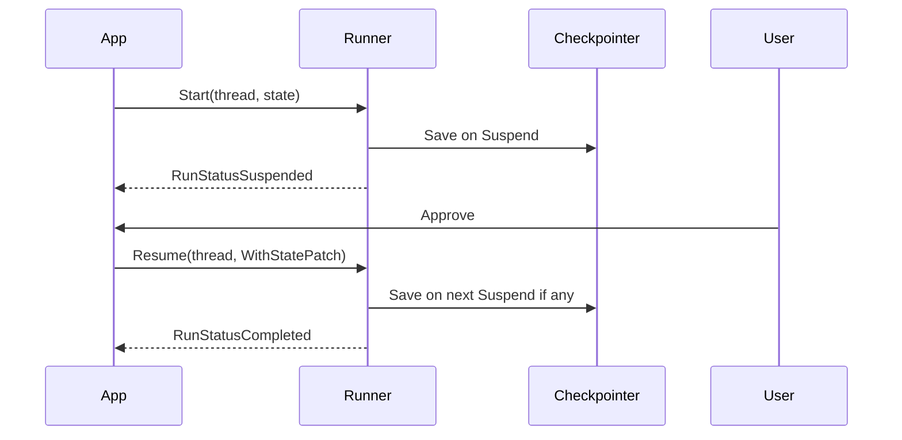

# Human-in-the-Loop (HITL)

Демонстрирует паузу графа до действия человека и продолжение через `Resume`.

## Было (legacy)

- Узел возвращал `(state, flowy.ErrSuspend)`.
- Клиент вручную разбирал checkpoint и вызывал старый `Stream` с `NextNode`.

## Стало (v1)

1. Узел `payment` возвращает `flowy.Suspend("waiting_for_user_approval")`.
2. Runtime автоматически вызывает `Checkpointer.Save`.
3. HTTP/UI слой вызывает `Runner.Resume(..., flowy.WithStatePatch(approve))`.
4. Граф продолжает с узла из snapshot (`payment`) с обновлённым state.

## Запуск

```bash
cd examples/hitl_agent
go run main.go
```

## Lifecycle


