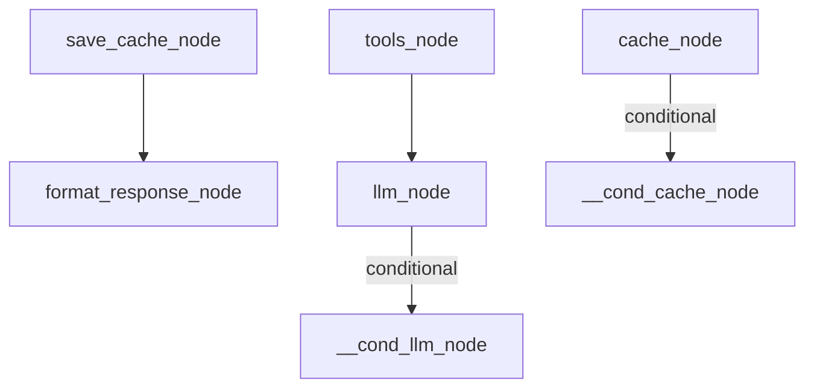

# Semantic caching agent

This example shows how to use flowy with a **semantic cache** to short-circuit expensive LLM calls: check the cache first, and only run the full LLM + tools path on cache miss.

## Graph structure

- **cache_node** — looks up the user query in the cache (stub; in production use ragy/cache with pgvector + embedder). Sets `CacheHit` and `FinalResponse` on hit.
- **llm_node** — simulates an LLM call; may request tools (sets `ToolCalls`) or return the final answer.
- **tools_node** — simulates tool execution; resets `ToolCalls` and appends to chat history.
- **save_cache_node** — writes the LLM response to the cache when it was a miss.
- **format_response_node** — formats the final response (terminal node).

Flow: `cache_node` → (conditional) → **format_response_node** (cache hit) or **llm_node** (miss). From `llm_node`, a conditional edge routes to **tools_node** (when `ToolCalls > 0`) or **save_cache_node** (when done). `tools_node` loops back to `llm_node`. Both paths converge at `format_response_node`.

Output of `graph.ExportMermaid()` for this graph:



## State contract

Which node reads/writes which fields of `AgentState`:

| Node                 | Writes                                                | Reads                    |
|----------------------|--------------------------------------------------------|--------------------------|
| cache_node           | `CacheHit`, `FinalResponse` (on hit)                  | `Query`                  |
| llm_node             | `FinalResponse`, `ToolCalls`                          | `ToolsUsed`              |
| tools_node           | `ToolCalls` (reset), `ToolsUsed`, `ChatHistory`       | —                        |
| save_cache_node      | —                                                     | `CacheHit`, `Query`, `FinalResponse` |
| format_response_node | `FinalResponse` (formatted)                           | `FinalResponse`          |

Type safety is ensured by using a typed `AgentState` struct (not `map[string]any`), so all field access is checked at compile time.

## What this demonstrates

- **Short-circuiting** — on cache hit, the graph skips the entire LLM and tools path and goes straight to formatting.
- **Merge reducer** — nodes return deltas (e.g. only `CacheHit` and `FinalResponse`); the reducer merges them into the current state.
- **Conditional edges** — `CacheRouter` and `LLMToToolsRouter` decide the next node from state.

## Running

```bash
go run .
```

First run with `"What is flowy?"` is a cache miss (full path). Second run with the same query is a cache hit (short-circuit). The example also prints the Mermaid diagram via `graph.ExportMermaid()`.
